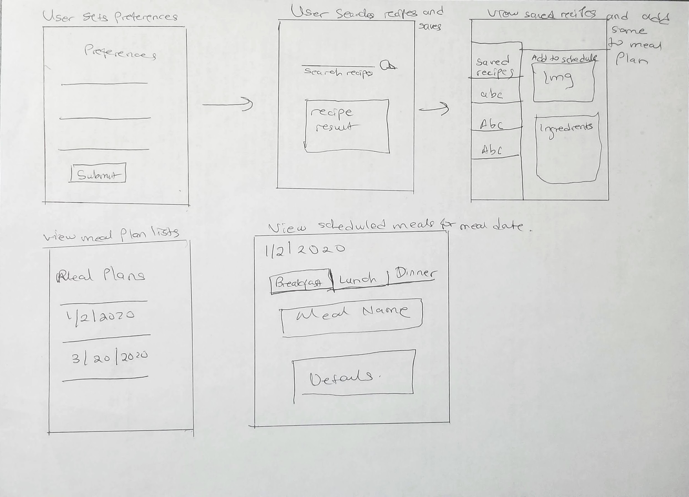
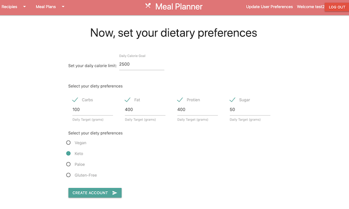
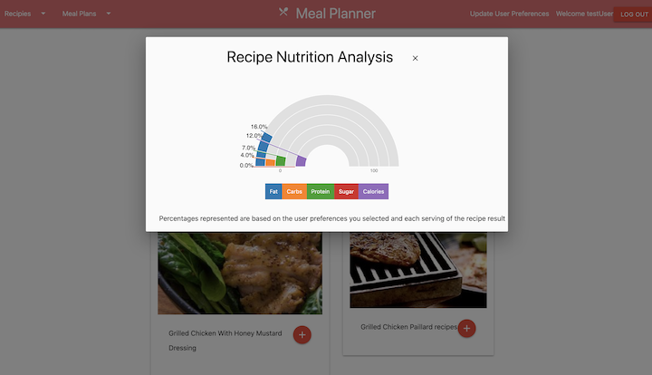
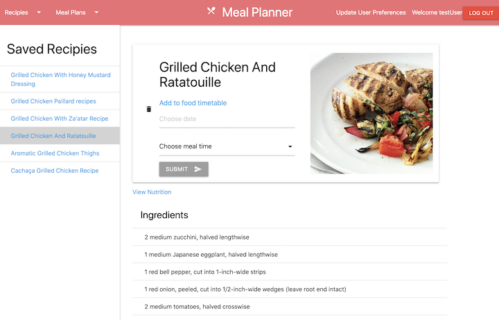

# Meal Planner Application (Project 2)

## Overview

Meal planner is a full meals management suite. Powered by the Edamam recipe search API, Meal Planner provides users a one stop shop to search for recipies within their dietary needs and save the ones they like to their account, and also create meal plans and generate ingredients shoping lists for their saved meal plans.

- [Project link](https://love-project2.herokuapp.com/).

## Technical Details

The application was built using node/express as server side technologies and MongoDb/Mongoose for database creation and management. The application has authentication through the express-sessions library. The front end was built with express ejs partials and the Billboard Js library (for data visualization). Materialize CSS was utilized for styling and special components like cards, tabs, modals etc.

- Wireframe
  

## Application Flow

The application landing page has links that take a user either to log in/ sign up. To signup, user must create login credentials and then set their dietary preferences (daily calorie limit, macros limits eg, fat, sugar, carbs, protein and also their diet style(keto, paleo, vegan, glutem free)). Dietary preferences are not required but are needed to provide the full value of the application.

After setting preferences, users can then search for recipes, and the preferences they have set are added as query strings in the api request to the EDAMAM recipes api. The results are shown and a user can view the nutrition analysis for each result (based on the preferences they had set. For example a search result for salmon will show the percentage of calories each serving of that salmon recipe will provide, based on the user's calorie limit if they filled out that preference ).

Users can save recipies they have searched for and then view all saved recipes on the favourites page. The application also allows a user to create meal plans from the saved recipes and even generate shopping lists from the saved meal plans.

## User Stories

- As a user I want to be able to see a form to create login credentials when so that I can sign up.
- As a user, I want to be able to enter my diet preferences so that when I search for recipes, I will only be shown recipes within my diet needs.
- As a user, I want to be able to search for and view recipes.
- As a user, I want to be able to see how much each recipe provides for my macros before saving.
- As a user I want to be able to save recipies from my recipe search results.
- As a user, I want to be able to view all my saved recipies.
- As a user I want to be able to create daily meal plans from the recipes I have saved.
- As a user I want to be able to edit , update and delete my saved meal plans.
- As a user I want to be able to generate , view and delete ingrediet lists for my saved meal plans
- As a user, I want to log out of the application and have my browser session closed when I am finished using the application.
